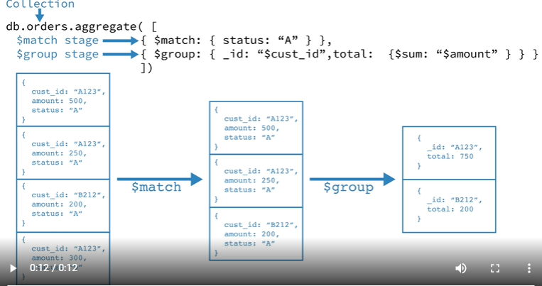
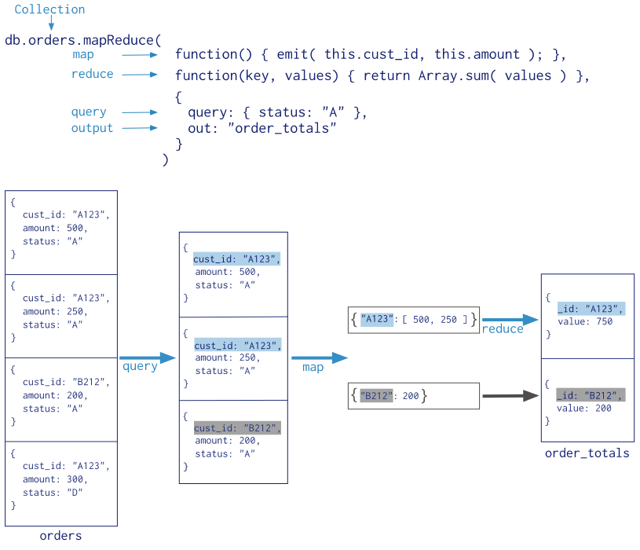
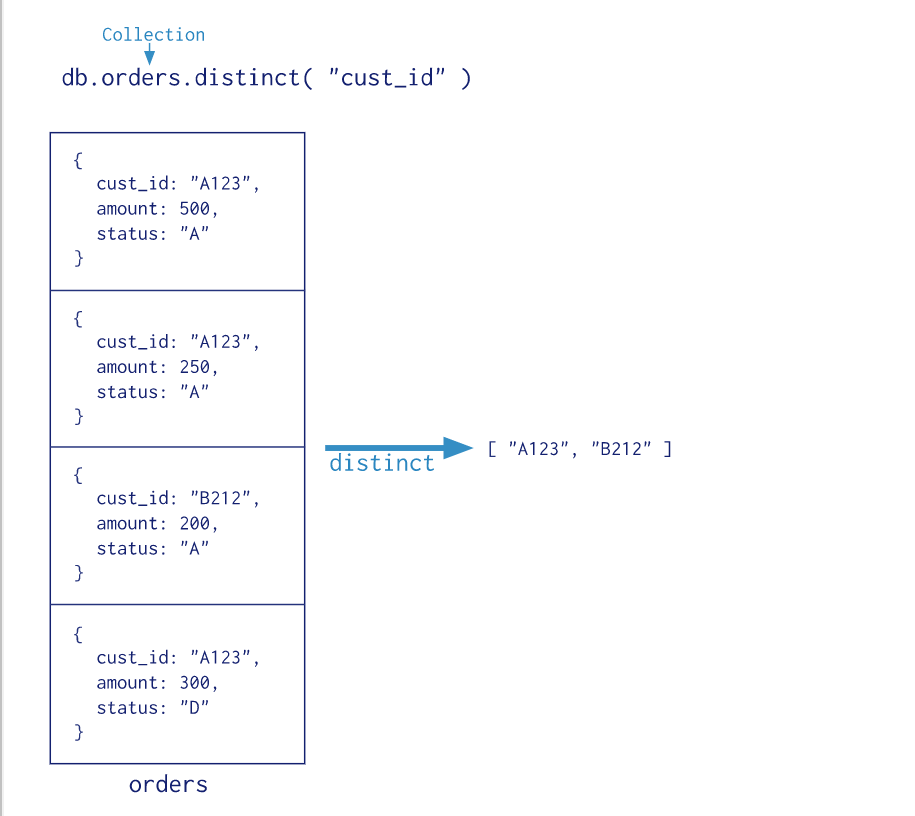
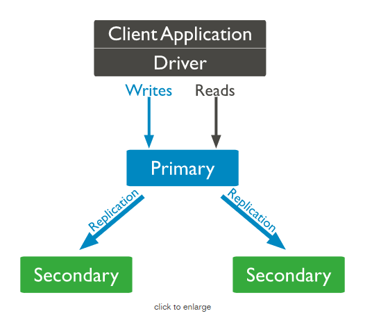

# mongo学习

## docker安装mongodb
* docker run --name mongo_server -p 27017:27017  -v /data/mongodb0:/data/db -d mongo
* docker exec -it dd36ab77a603 /bin/bash
* use admin;
* db.createUser({user:"admin",pwd:"admin",roles:[{role:"root",db:"admin"}]});
* mongo --port 27017 -u admin -p admin --authenticationDatabase admin
* use test;
* db.createUser({user:"admin",pwd:"admin",roles:[{role:"root",db:"admin"}]});
* mongo --port 27017 -u test -p test --authenticationDatabase test;
* db.test.insert({"key":"value"});
* show dbs;


## 聚合(Aggregation)
#### 简述
> 所谓聚合就是将一堆数据进行处理，返回我们所需的数据
#### aggregation pipeline
* 管道聚合
```
db.orders.aggregate([
   { $match: { status: "A" } },
   { $group: { _id: "$cust_id", total: { $sum: "$amount" } } }
])
```

#### map-reduce function
* 优缺点
> 1. 使用了用户自定义的js function 去执行map和reduce操作
> 2. 相比于管道聚合更为灵活，支持更复杂的操作，但是性能要比管道聚合低
* 例如map-reduce聚合

#### single purpose aggregation methods
 > MongoDB 提供了一些方法实现聚合
 > 1. db.collection.estimatedDocumentCount(), 
 > 2. db.collection.count() 
 > 3. db.collection.distinct().
 * 例如去重方法（distinct method）
 
## 数据模型（data models）
> 在设计数据结构的时候需要平衡业务需求和存储引擎性能
## 事务
#### runtime limit
* 默认情况下，事务的运行时间必须少于一分钟（整个事务生命周期是一分钟？）
> 原文：By default, a transaction must have a runtime of less than one minute
* 可以设置transactionLifetimeLimitSeconds修改runtime limit
* 超过这个limit的事务将被视为已过期的事务，将会被定期清除线程（process）中止
> 原文：Transactions that exceeds this limit are considered expired and will be aborted by a periodic cleanup process.
#### aplog(operations log) size limit
* 4.2开始
> 1. 在一个事务中根据需求创建多个aplog来封装所有的写操作，每个aplog的大小是16M
#### WiredTiger cache
> To prevent storage cache pressure from negatively impacting the performance:(为了防止存储引擎缓存压力对性能造成负面影响)
> 1. When you abandon a transaction, abort the transaction.
> 2. When you encounter an error during individual operation in the transaction, abort and retry the transaction.
* mongodb有进程会定期清除那些已经过期的事务
#### Shard Configuration Restriction
* 在分片集群中如果writeConcernMajorityJournalDefault = false不能使用事务
#### 3-Member Primary-Secondary-Arbiter Architecture
* On sharded clusters
> 1. 如果一个事务涉及到的一个已经disabled read concern "majority" 的shard，就不能对这个事务使用read concern "snapshot"，只能使用read concern "local"和"majority"
> 2. 如果事务中的读或者写操作涉及的shard设置了 disabled read concern "majority".事务中一个写操作涉及到了多个shard会报错并且中止
* On replica set
> 1. You can specify read concern "local" or "majority" or "snapshot" even in the replica set has disabled read concern “majority”.
* 如何查看read concern “majority”是否disabled
> mongod run db.serverStatus(),查看 storageEngine.supportsCommittedReads，如果为false则read concern “majority” is disabled.
#### acquiring locks
* 默认情况下，事务等待获取锁的时间是5毫秒，超过这个时间，没有获取到对应锁这个事务会中止（abort）
#### lock request timeout
* 可以设置maxTransactionLockRequestTimeoutMillis去调整事务等待获取锁的时间
> 1. 提高这个值可以避免某个时间点突然涌现大量请求导致transaction aborts
> 2. 提高这个值有可能导致延迟中止死锁
#### pending DDL operations and transactions
> muti-document事务在他们访问得collections获取了排他锁，新建DDL操作需要等待对应的collections或者parent database事务释放锁，当pending DDL operations存在，新建事务不能获取所需要的锁并且将会中止在maxTransactionLockRequestTimeoutMillis之后，另外新建一个不带事务的操作去访问相同的collections将会被阻塞直到到达他们的maxTimeMS限制。
> * 原文：Multi-document transactions acquire exclusive locks on the collections which they access. New DDL operations that require locks on those collections or their parent databases must wait until the transaction releases its locks. While these pending DDL operations exist, new transactions that access the same collection(s) as the pending DDL operations cannot obtain the required locks and and will abort after waiting maxTransactionLockRequestTimeoutMillis. In addition, new non-transaction operations that access the same collection(s) will block until they reach their maxTimeMS limit.
#### In-progress Transactions and Stale Reads
* 一个事务中的读操作可能返回的是旧的数据（在mysql叫读未提交隔离级别），事务中的读操作不保证能够看到其他事务的或者非事务的写操作
#### Outside Reads During Commit
* 场景
> 在一个事务commit期间，外部的读操作可能会去读这个相同的document已经被事务修改过的，如果事务向多个shard,这个事务的commit时间将跨越锁的shard
1. 如果外部读使用 read concern snapshot or "linearizable"，需等待事务所有的写可见（wait for all writes of a transaction to be visible.）
2. 使用其他read concern的外部读取不等待事务的所有写入可见，而是读取可用文档的交易前版本
#### drivers
* 为了使用事务，client必须使用4.2 drivers
## 主从（replication）
#### 定义
* A replica set in MongoDB is a group of mongod processes that maintain the same data set
> A replica set在mongodb是存储相同数据的一组mongd进程
* Replica sets provide redundancy and high availability, and are the basis for all production deployments
> replica sets 提供了冗余和高可用的能力，并且是所有生产环境的基础配置
#### Replica 结构

* 主实例接收所有写操作，通过aplog同步到从实例
* 所有的replica set都能接收读操作，然而默认情况下一个应用将其读操作定向到主实例
* 只能只有一个主实例，如果主实例挂了，就会选出一个新的主实例[选举策略](https://docs.mongodb.com/manual/core/replica-set-elections/)
* 如果主实例超过electionTimeoutMillis period (10 seconds by default)没有和其他成员联系，则被认为offline,然后从新选举主实例，在选举的过程中，不能提供写操作，如果配置了[run on secondaries](https://docs.mongodb.com/manual/core/read-preference/#replica-set-read-preference),读操作可以从从实例查询数据
* electionTimeoutMillis可以快速定位故障点，但是也可能导致频繁的选举，由于一些网络的因素
* 从3.6开始，mongodb drivers能够检测主实例是否挂了，自动重试某些写入操作，并提供对自动故障转移和选择的其他内置处理
#### data visibility
* 使用local或者available read concern能够看到其他写未提交的数据
* 使用local或者available read concern可能看到其他事务将会回滚的数据
#### transactions
* Multi-document transactions包含的所以读操作必须使用主实例，所有的操作必须路由到主实例
> Multi-document transactions that contain read operations must use read preference primary. All operations in a given transaction must route to the same member.
* 事务未提交的修改对于其他事务是不可见的
> Until a transaction commits, the data changes made in the transaction are not visible outside the transaction.
#### arbiter
* 必须选择一个额外得mongod作为arbiter,这个arbiter不回去存储数据，只存储通过其他replica set的心跳和election request确定的法定人数
>  The purpose of an arbiter is to maintain a quorum in a replica set by responding to heartbeat and election requests by other replica set members
* arbiter 没有存储数据，所以不能变成主实例
## 分片（sharding）
 
 
## mongo条件操作符
* where score = 75 {“score”:75}
* where score < 75 {“score”:{$lt:75}}
* where score <+ 75 {"score" :{$lte:75}}
* where score > 75 {"score":{$gt:75}}
* where score >= 75 {"score": {$gte:75}}
* where score != 75 {"score": {$ne:75}

## mongo存储引擎
#### 如何配置存储引擎

#### WiredTiger
* is the default storage engine starting in MongoDB 3.2
* WiredTiger provides a document-level concurrency model(行级别锁？)
#### In-Memory
* 纯内存存储，纯内存必然就会伴有机器挂了数据不能保存
* --bdpath:内存存储引擎不会将数据存在磁盘上，但还是会保存少部分元数据文件（small metadata files）和 diagnostic data以及构建大型索引的临时文件
> Although the in-memory storage engine does not write data to the filesystem, it maintains in the --dbpath small metadata files and diagnostic data as well temporary files for building large indexes.
* concurrency
> The in-memory storage engine uses document-level concurrency control for write operations. As a result, multiple clients can modify different documents of a collection at the same time.
> 并发控制在文档级别（行锁），即多个客服端能同时修改同一个集合上的不同行
* 默认情况下内存存储引擎使用实际物理内存的50%-1G
* 如何在集群中有具有投票的实例使用了in-memory,必须设置writeConcernMajorityJournalDefault=false
> If any voting member of a replica set uses the in-memory storage engine, you must set writeConcernMajorityJournalDefault to false.
> Starting in version 4.2 (and 4.0.13 and 3.6.14 ), if a replica set member uses the in-memory storage engine (voting or non-voting) but the replica set has writeConcernMajorityJournalDefault set to true, the replica set member logs a startup warning.
* mongodb4.2支持在集群中使用事务
> * 主实例使用WiredTiger（the primary uses the WiredTiger storage engine）
> * 从实例使用WiredTiger或者in-memory(the secondary members use either the WiredTiger storage engine or the in-memory storage engine)
* In MongoDB 4.0, 只支持replica sets使用WiredTiger（only replica sets using the WiredTiger storage engine supported transactions.）
#### MMAPv1
* 在4.2版本被移除


## mongo索引
#### 1.single indexes
#### 2.compound indexes
#### 3.multikey index
* compound indexes 排序
## mongo索引类型
#### 1.geospatial Indexes
#### 2.Text Indexes
* 基于lucene
#### 3.Hashed Indexes

## mongo锁
#### 使用了什么锁机制

#### 锁粒度

#### 是否支持高并发

## 待解决问题
* mongodb update 会加锁吗？
* mongodb 索引数据结构？
* mongodb分页内存爆炸？